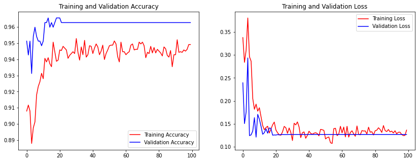
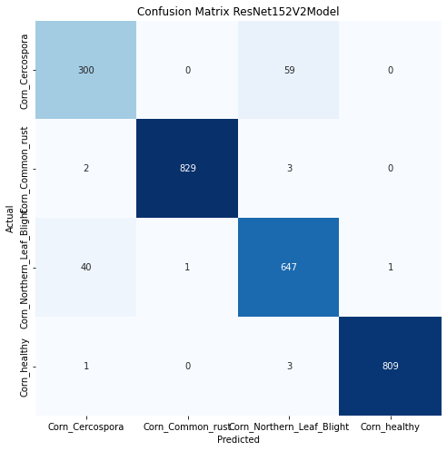

# PENERAPAN CNN UNTUK MENDETEKSI DAN MENGKLASIFIKASIKAN PENYAKIT DAUN JAGUNG SEBAGAI PENDUKUNG SISTEM PERTANIAN DIGITAL
Muhammad Aries Ramadhan - 201810370311076

## Journal
Pada jurnal dataset yang digunakan menggunakan dataset gambar yang berasal dari PlantVillage. 
Pada penelitian ini akan dilakukan pengujian dan peningkatan performa menggunakan 11 model CNN yang telah dilakukan augmentasi data. Augmentasi data dapat mengurangi overfitting sehingga dapat menghasilkan model dengan performa terbaik. Metode yang peneliti usulkan telah dilakukan proses training dan testing data pada Plant’s Village Dataset. DenseNet201 dengan data augmentation mendapatkan tingkat akurasi sebesar 97%.

## Dataset
Dataset yang digunakan adalah Plant Leaf Diseses yang bersumber dari PlantVillage. dalam dataset tersebut memiliki 39 kelas yang berbeda dari daun tanaman dan gambar latar belakang. Namun kita hanya menggunkan 4 kelas untuk klasifikasi penyakit daun jagung. dengan deskripsi seperti berikut: 

- Link Dataset : [Dataset : Plant Leaf Diseases](https://data.mendeley.com/datasets/tywbtsjrjv/1)
- Jumlah image pada dataset 3852.
- Jumlah image pada setiap kelas
  - healthy               : 1162
  - Cercospora            : 513
  - common rust           : 1192
  - northern leaf blight  : 958
- Jumlah persentase spliting dataset
  - Data Train                                   : 80% - 2695
  - Data Validation/Test (using same data)       : 30% - 349 

## Preprocessing
Preprocesing data menggunakan metode berikut :
- Augmentasi Data
  - rescale = 1./255
  - horizontal flip = True
  - vertical flip = True
  - rotation range = 90
  - height shift range = 0.2
  - width shift range = 0.2
  - zoom range = 0.2
  - validation split = 0.7
  - size = (224, 224)
  - color mode = 'rgb'
  - class mode = 'categorical'
  - shuffle = True

## Model Terbaik
Model yang digunakan adalah Alexnet Model
- Model 1 (DenseNet201)
  - Confution matriks evaluation 
    
  - grafik akurasi dan loss 
    
  - Classification Report 
    |                      | precision | recall | f1-score | support |
    |----------------------|-----------|--------|----------|---------|
    | Cercospora           | 0.92      | 0.86   | 0.89     | 359     |
    | Common_rust          | 1.00      | 0.99   | 1.00     | 834     |
    | Northern_Leaf_Blight | 0.92      | 0.96   | 0.94     | 683     |
    | Corn_healthy         | 1.00      | 1.00   | 1.00     | 813     |
    |                      |           |        |          |         |
    | macro avg            | 0.96      | 0.95   | 0.96     | 2695    |
    | weighted avg         | 0.97      | 0.97   | 0.97     | 2695    |
    | accuracy             |           |        | 0.97     | 2695    |
    

- Model 2 (Densenet201)
  - Confution matriks evaluation 
    
  - grafik akurasi dan loss 
    
    
  - Classification Report 
    |                      | precision | recall | f1-score | support |
    |----------------------|-----------|--------|----------|---------|
    | Cercospora           | 0.87      | 0.84   | 0.85     | 359     |
    | Common_rust          | 1.00      | 0.99   | 1.00     | 834     |
    | Northern_Leaf_Blight | 0.91      | 0.94   | 0.92     | 689     |
    | Corn_healthy         | 1.00      | 1.00   | 1.00     | 813     |
    |                      |           |        |          |         |
    | macro avg            | 0.95      | 0.94   | 0.94     | 2695    |
    | weighted avg         | 0.96      | 0.96   | 0.96     | 2695    |
    | accuracy             |           |        | 0.96     | 2695    |
    
    
## Tabel Akurasi
| CNN Model	             | Accuracy (%) |
|------------------------|--------------| 
| DenseNet201	           |  97          |
| ResNet152 V2	         |  96          |
| VGG16	                 |  95          |
| MobileNet V2	         |  95          |
| Alexnet	               |  94          |
| VGG19	                 |  94          |
| Inception V3	         |  94          |
| Xception	             |  94          |
| Inception ResNet V2	   |  94          |
| ResNet50	             |  60          |
| ResNet101	             |  58          |

## Sumber Referensi
 - [Dataset : Plant Leaf Diseases](https://data.mendeley.com/datasets/tywbtsjrjv/1)
 - [Artikel rujukan](http://dx.doi.org/10.12928/telkomnika.v18i3.14840)

